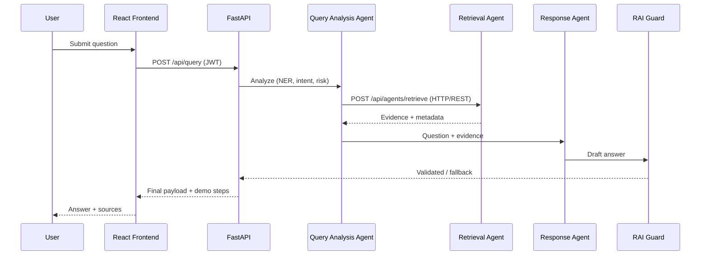

# Agent Communication Flow — PublicHealth-AI

**Status:** Implemented (Phases 6–7).

## Agents

### Agent 1 — Query Analysis Agent

**Input:** Natural-language user query (after PII sanitization)  
**Output:** Structured JSON

```json
{
  "original_query": "What are the warning signs of dengue?",
  "intent": "WARNING_SIGNS",
  "entities": {
    "disease": ["dengue"],
    "medical_topic": ["warning signs"]
  },
  "risk_level": "LOW"
}
```

### Agent 2 — Medical Document Retrieval Agent

**Input:** Structured payload from Agent 1  
**Output:** Evidence chunks with scores and metadata

```json
{
  "status": "success",
  "results": [
    {
      "source": "WHO",
      "title": "Dengue Guidelines",
      "page": 15,
      "score": 0.92,
      "text": "...",
      "url": "https://example.org/source"
    }
  ]
}
```

### Agent 3 — Evidence-Based Response Agent

**Input:** Original question + retrieved evidence  
**Output:** Concise public-health explanation with citations (evidence-only)

## Protocol: HTTP/REST + JSON

Agents communicate over the FastAPI process using explicit REST endpoints.

```
Agent 1  →  POST /api/agents/retrieve  →  Agent 2
```

### Implemented endpoints

| Endpoint | Agent | Description |
|----------|-------|-------------|
| `POST /api/agents/analyze` | Agent 1 | NER, intent, risk → structured JSON |
| `POST /api/agents/retrieve` | Agent 2 | Vector search → evidence chunks |
| `POST /api/query` | Orchestrator | Full pipeline with demo steps 1–4 |

### Request — Agent 1 analyze

`POST /api/agents/retrieve`

```json
{
  "query": "What are the warning signs of dengue?",
  "intent": "WARNING_SIGNS",
  "entities": { "disease": ["dengue"] },
  "risk_level": "LOW"
}
```

### Planned response

```json
{
  "status": "success",
  "results": [ /* evidence chunks */ ]
}
```

## Sequence (mid-eval demo)



## Demo visibility (Week 6)

The UI will show Steps 1–7: query received → Agent 1 → HTTP call → Agent 2 → Response Agent → RAI check → final answer.

Implementation: Phases 6–8 (backend), Phase 12 (frontend demo panel).
