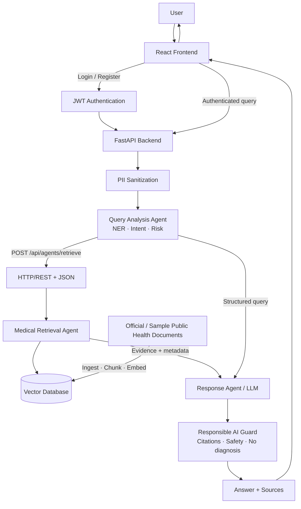

# System Architecture — PublicHealth-AI

**Status:** Phase 1 skeleton. Agent and IR components are designed here and implemented in later phases.

## Positioning

PublicHealth-AI is an **Evidence-Grounded Public Health Information Assistant**.

It does **not** diagnose, prescribe, or replace clinical care. Answers must be grounded in retrieved public-health evidence with source attribution.

## Component overview

| Component | Technology | Responsibility |
|-----------|------------|----------------|
| Frontend | React + Vite | Login/Register, assistant UI, demo step visualization |
| API gateway | FastAPI | Auth, query orchestration, agent HTTP endpoints |
| Query Analysis Agent | Python + spaCy/rules | Sanitize, NER, intent, risk → structured JSON |
| Retrieval Agent | TF-IDF / Sentence Transformers + NumPy vector store | Top-K evidence + metadata |
| Response Agent | Configurable LLM | Evidence-only answer + citations |
| Responsible AI Guard | Rule + validation checks | Safety, citation integrity, PII |
| Knowledge base | Chunked docs + metadata | WHO/CDC/ministry (or labeled sample data for dev) |

## Mermaid architecture diagram

## Data & control flow (summary)

1. User authenticates (JWT).
2. Query is sanitized (PII redacted).
3. Agent 1 produces structured analysis.
4. Agent 1 calls Agent 2 over HTTP/REST.
5. Agent 2 returns top-K chunks with source metadata.
6. Response Agent generates an answer **only** from evidence.
7. Responsible AI Guard validates citations and safety; may replace with a safe fallback.
8. Frontend shows answer, NER/intent/risk, evidence, and demo steps.

## Security touchpoints

- Secrets via `.env` (never hardcoded)
- Password hashing (bcrypt) — Phase 11
- JWT-protected query routes — Phase 11
- PII sanitization before LLM — Phase 10/11
- Input validation on all APIs

## IR / RAG notes

- Default `TOP_K = 5`
- Every chunk retains: `document_id`, `source`, `title`, `page`, `year`, `disease`, `url`
- Designed to allow later hybrid upgrade (vector + BM25)

## Phase 1–4 delivered

- Repository layout matching the assignment structure
- FastAPI app with `/health` (includes retrieval readiness)
- Config via `pydantic-settings`
- React shell with health connectivity check
- **Document ingestion:** `scripts/ingest_documents.py` + 6 labeled sample documents
- **Vector store:** NumPy persistence with TF-IDF embeddings (Python 3.13 compatible)
- **Retriever:** `DocumentRetriever` + `POST /api/retrieval/search`
- Optional upgrade path: Chroma/FAISS + sentence-transformers on Python 3.10–3.12
